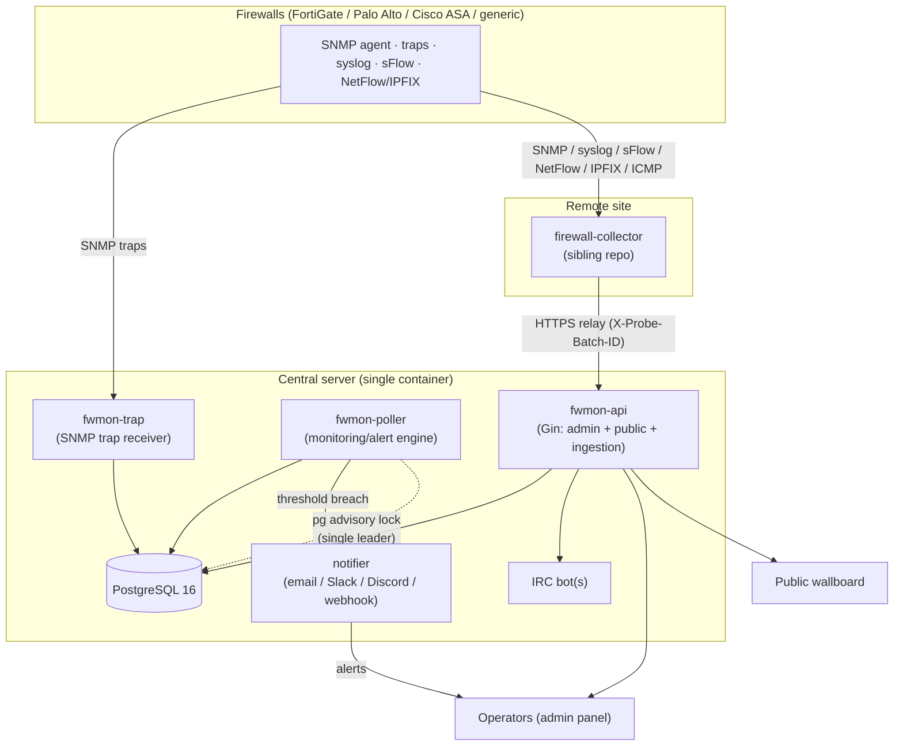
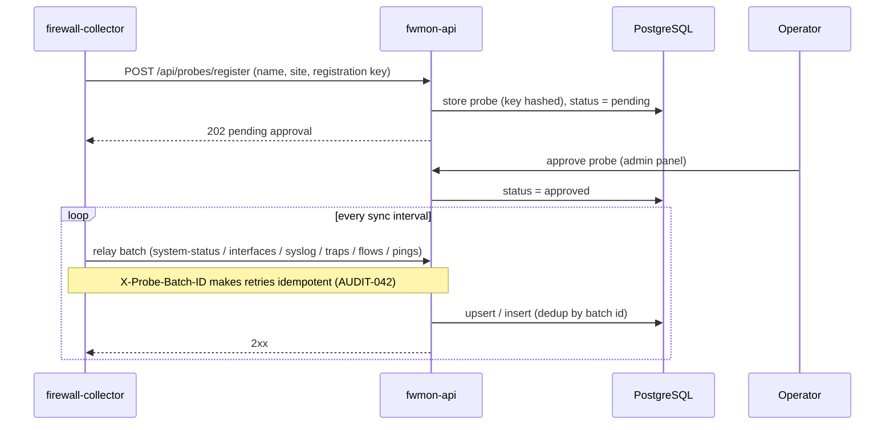
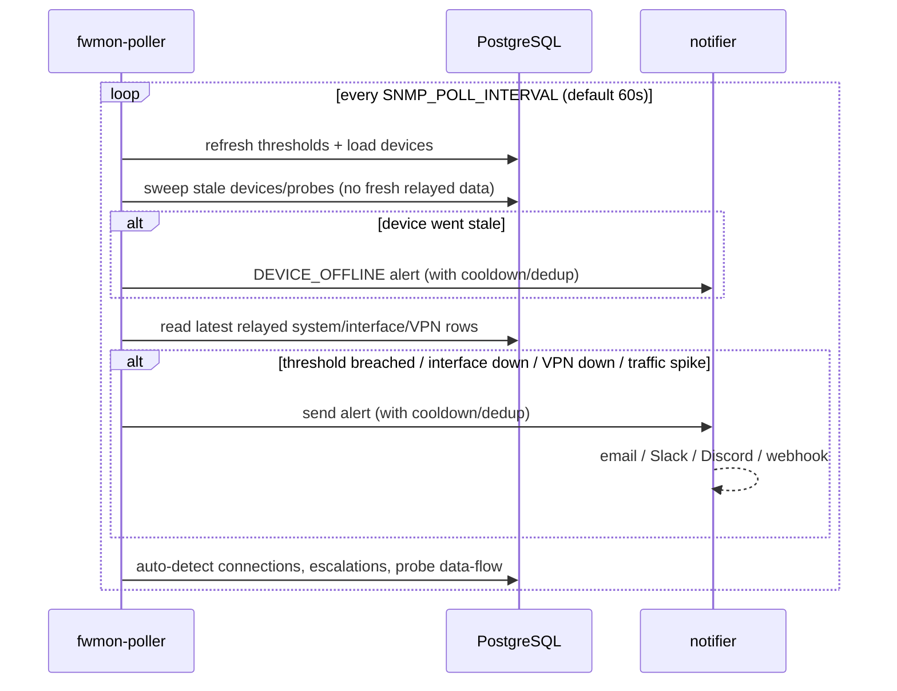
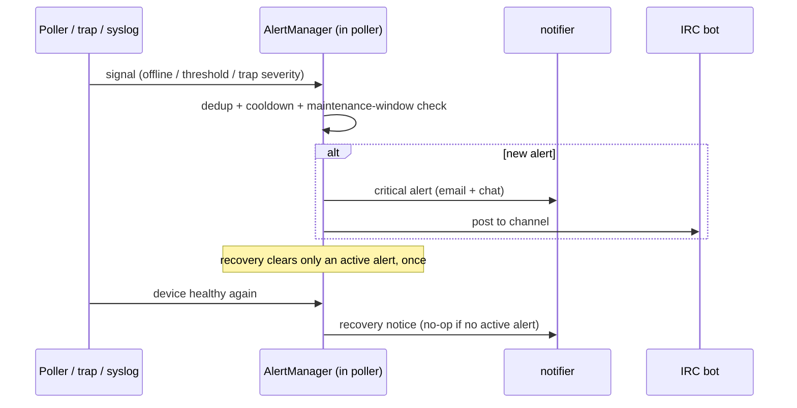

# Architecture

How Firewall-Mon's processes, data stores, and external systems fit together
(AUDIT-108). For per-component code layout see the tree in the
[README](../README.md#architecture); for operations see
[OPERATIONS.md](OPERATIONS.md).

## Components & data flow

Three long-running server daemons (`fwmon-api`, `fwmon-poller`, `fwmon-trap`)
share one database; `configcheck` is a one-shot CLI, not a daemon. The server
never polls devices itself (the direct SNMP loop was retired in v0.11.74):
every firewall is polled by a **collector** (probe) at its site, which relays
the data back; `fwmon-poller` is the monitoring/alert engine that evaluates
the relayed data.

**Notes**
- The three server daemons (`api`, `poller`, `trap`) are separate processes
  sharing the DB; in the Docker image they run side-by-side under one
  entrypoint with PostgreSQL embedded.
- The **poller** never talks SNMP to devices — it is the monitoring/alert
  engine. Devices are polled at the edge by collectors; each poller cycle
  evaluates the relayed DB rows: offline sweeps (stale `last_polled` →
  DEVICE_OFFLINE + recovery), CPU/memory/disk/session/interface/VPN threshold
  checks, traffic-spike detection, connection auto-detection, alert
  escalations, and probe data-flow lag (v0.11.74). An enabled device with no
  collector assigned is not monitored and is called out in the poller log.
- Only one poller does migration/cleanup work at a time, gated by a Postgres
  advisory lock (AUDIT-007).
- Secrets (SNMP/IRC/SMTP) are encrypted at rest with an AES-256 key derived
  from the persisted JWT secret (AUDIT-008); probe registration keys are hashed
  (AUDIT-017).

## Sequence: probe registration

## Sequence: monitoring cycle (poller)

## Sequence: alert firing & recovery

## Where things live (quick map)

| Concern | Package / path |
|---|---|
| HTTP handlers (admin / public / ingestion) | `internal/api/handlers/` |
| Security middleware (CSP, CSRF, rate limit, headers) | `internal/api/middleware/` |
| SNMP client + vendor profiles | `internal/snmp/` (`vendor_*.go`) |
| Database access + migrations | `internal/database/` |
| Alert thresholds + state machine | `internal/alerts/` |
| Notifications | `internal/notifier/` |
| Probe wire contract (DTOs + schema version) | `internal/relay/` |
| Config-backup change detection | `internal/configdiff/` |
| Persisted secrets (JWT / admin) | `internal/secrets/` |
| Frontend (admin SPA + wallboard) | `cmd/api/static/`, `web/` |
